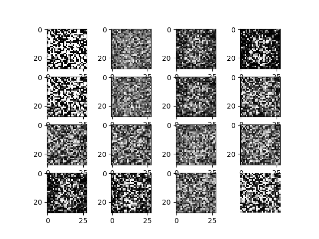
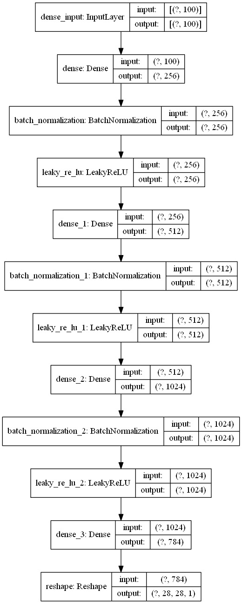
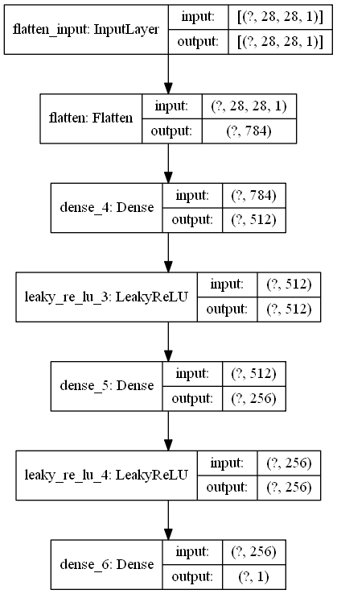
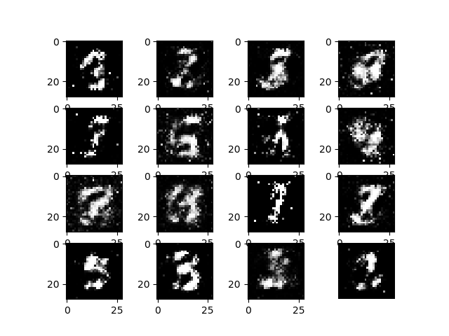
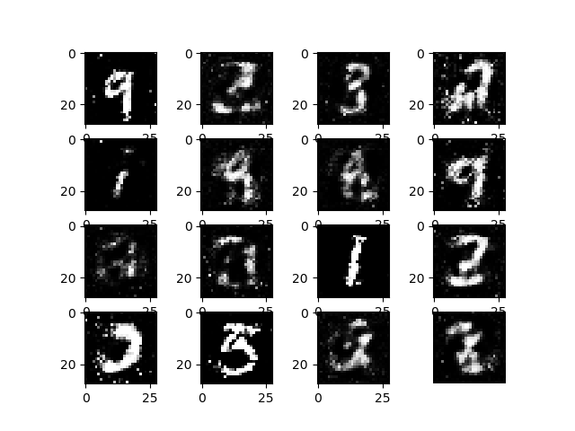
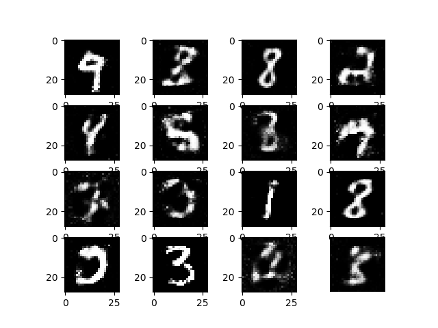

# GAN-TensorFlow 2.0
Tensorflow2.0 implementation of GAN.

<center></center>

---  

## Requirements
- tensorflow 2.0
- python 3
- numpy
- For make GIF & plot
  - glob
  - imageio
  - matplotlib

---

## GAN Model
### **Generator**
<center></center>

### **Discriminator**
<center></center>

---

## Documentation
### Download Dataset
MNIST dataset will be downloaded automatically.
```
(train_images, train_labels), (_, _) = tf.keras.datasets.mnist.load_data()
```

### Training GAN
Use `basic_gan.py` to train a basic GAN network.

---

## Results
### epoch = 1
<center></center>

### epoch = 50
<center></center>

### epoch = 100
<center></center>

### epoch = 200
<center></center>

---

## Reference
 [Ian J. Goodfellow. *Generative Adversarial Nets*, NIPS2014.](https://arxiv.org/abs/1406.2661).
